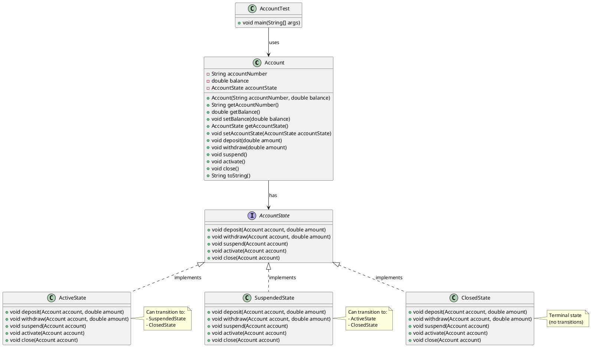

# Bank Account State Manager

A Java implementation of the **State Design Pattern** for efficient bank account state management and transaction processing. This project demonstrates how to use state objects to manage different account behaviors without complex conditional logic.

## 📋 Overview

The Bank Account State Manager allows you to manage bank accounts in different states (Active, Suspended, and Closed) with state-specific behavioral rules. Instead of using complex if-else statements, the system uses separate state classes to handle different account behaviors, making the code more maintainable and extensible.

## 🏗️ Architecture

This project implements the **State Design Pattern** with the following components:

- **Account Class**: The context class that maintains a reference to the current state
- **AccountState Interface**: Defines the contract for all state implementations
- **Concrete State Classes**: ActiveState, SuspendedState, and ClosedState implementations
- **Test Application**: Demonstrates the state pattern in action

### Design Pattern Benefits

- **Maintainability**: Eliminates complex conditional statements by encapsulating state-specific behavior
- **Extensibility**: Easy to add new account states without modifying existing code
- **Single Responsibility**: Each state class handles only its specific behavior
- **Open/Closed Principle**: New states can be added without changing the Account class

## 📊 UML Class Diagram

The following PlantUML diagram illustrates the architecture of the Bank Account State Manager:



**Diagram Key:**
- **Account**: The context class that maintains the current state
- **AccountState**: Interface defining the contract for all states
- **Concrete States**: ActiveState, SuspendedState, and ClosedState implementations
- **Relationships**: Shows inheritance (implements) and composition (has) relationships
- **State Transitions**: Notes indicate possible state transitions

*Note: This diagram can be rendered using PlantUML, VS Code with PlantUML extension, or online PlantUML renderers.*

## 🚀 Features

- **Multiple Account States**: Support for Active, Suspended, and Closed account states
- **State-Specific Behavior**: Each state enforces its own transaction rules
- **Automatic State Transitions**: Seamless transitions between account states
- **Type-Safe Operations**: Strong typing for each state implementation
- **Clean Architecture**: Well-structured, maintainable code

## 📁 Project Structure

```
bank-account-state-pattern/
├── src/
│   ├── Account.java                  # Main account context class
│   ├── AccountState.java             # State interface
│   ├── ActiveState.java              # Active state implementation
│   ├── SuspendedState.java           # Suspended state implementation
│   ├── ClosedState.java              # Closed state implementation
│   └── AccountTest.java              # Main application demo
└── README.md                         # Project documentation
```

## 🛠️ Installation & Setup

### Prerequisites

- Java Development Kit (JDK) 8 or higher
- Any Java IDE (IntelliJ IDEA, Eclipse, VS Code, etc.)

### Getting Started

1. **Clone or download** the project files
2. **Navigate** to the project directory
3. **Compile** the Java files:
   ```bash
   javac src/*.java
   ```
4. **Run** the application:
   ```bash
   java -cp src AccountTest
   ```

## 📖 Usage

### Basic Usage

The main application (`AccountTest.java`) demonstrates how to use the state pattern:

```java
// Create a new account (starts in Active state)
Account myAccount = new Account("1234", 10000.0);

// Perform transactions (allowed in Active state)
myAccount.deposit(1000.0);
myAccount.withdraw(100.0);

// Change account state
myAccount.suspend();  // Active → Suspended
myAccount.activate(); // Suspended → Active
myAccount.close();    // Active → Closed
```

### Expected Output

When you run the application, you'll see:

```
Account is already activated!
Account is suspended!
Account is activated!

Deposited 1000.0
Account Number: 1234
Balance: 11000.0

Withdrew 100.0. 
Account Number: 1234
Balance: 10900.0

Account is closed!
You cannot activate a closed account!
You cannot suspend a closed account!
You cannot withdraw on a closed account.
Account Number: 1234
Balance: 10900.0

You cannot deposit on a closed account.
Account Number: 1234
Balance: 10900.0
```

## 🎯 Account States & Permissions

| State | Deposit | Withdraw | Activate | Suspend | Close | View Info |
|-------|---------|----------|----------|---------|-------|-----------|
| **Active** | ✅ | ✅ | ❌ | ✅ | ✅ | ✅ |
| **Suspended** | ❌ | ❌ | ✅ | ❌ | ✅ | ✅ |
| **Closed** | ❌ | ❌ | ❌ | ❌ | ❌ | ✅ |

### State Transitions

```
Active ←→ Suspended
   ↓        ↓
Closed ←→ Closed
```

- **Active → Suspended**: Account can be suspended
- **Suspended → Active**: Account can be reactivated
- **Active/Suspended → Closed**: Account can be closed
- **Closed**: Terminal state (no further transitions allowed)

## 🔧 Extending the Project

### Adding New Account States

To add a new account state (e.g., `FrozenState`):

1. **Create** a new class implementing the `AccountState` interface
2. **Implement** all required methods with state-specific behavior
3. **Add** state transition logic to existing states if needed

Example:
```java
public class FrozenState implements AccountState {
    @Override
    public void deposit(Account account, double amount) {
        System.out.println("You cannot deposit on a frozen account!");
    }
    
    @Override
    public void withdraw(Account account, double amount) {
        System.out.println("You cannot withdraw on a frozen account!");
    }
    
    // Implement other methods...
}
```

## 🎯 Design Patterns Used

### State Pattern
- **Purpose**: Allow an object to alter its behavior when its internal state changes
- **Benefits**: Eliminates complex conditional statements and improves maintainability
- **Implementation**: Each state class implements `AccountState` interface and handles specific behavior

### Context Pattern
- **Purpose**: Maintains a reference to the current state and delegates operations to it
- **Benefits**: Provides a clean interface for state-dependent operations
- **Implementation**: `Account` class maintains state reference and delegates method calls

## 🧪 Testing

The `AccountTest` class provides comprehensive testing of:

- ✅ State transitions (Active ↔ Suspended → Closed)
- ✅ Transaction permissions in each state
- ✅ Error handling for invalid operations
- ✅ Account information display

## 🤝 Contributing

Feel free to contribute to this project by:
- Adding new account states
- Improving documentation
- Enhancing the state pattern implementation
- Adding unit tests

## 📄 License

This project is open source and available under the [MIT License](LICENSE).

---

**Note**: This implementation demonstrates clean code principles and design patterns best practices. The State pattern is particularly useful when an object's actions must adapt dynamically to its current state, making it ideal for systems with numerous states or states that evolve frequently.
